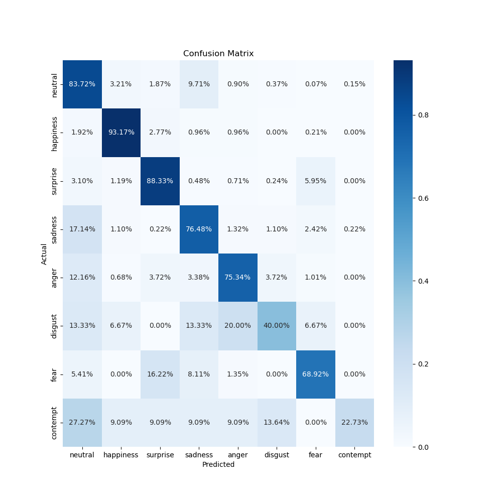

# DatesNet: Facial Emotion Recognition 
---
Implementation of a Facial Emotion Recognition on FER+ dataset. The implementation contains 3 separate model architectures. 
- Simplest of all MLP architecture with a couple of Convolution layers with Max pooling.
- Shortened, customized VGGNet architecture with much fewer layers
- UNet with Residual and Self-Attention blocks

**Link to FER+ dataset:** [FER+](https://github.com/microsoft/FERPlus/tree/master)

## Training
---
The training code need the proper configuration set in the ***config/datesnet_config.py***. The 
model uses PyTorch. To create the environment, run
````commandline
create_and_set_environment.bat
````
If all your configurations are set in the ***config/datesnet_config.py***, then run
````python
python train.py
````
Training will log the loss from training and validation in the ***logdir*** folder. 
Since Tensorboard is to log the data, run the following command in another cmd inside the directory.
Make sure that you are in side the parent directory, i,e. inside ***/datesnet/***.
````commandline
conda activate datesnet
tensorboard --logdir logdir
````
The training code will save 2 models, one ***datesnet_model_cont.pth*** and ***datesnet_model.pth***. 
The ***datesnet_model.pth*** is the final mode saved when the best validation loss is achieved.

| Architecture             | File                                                     | Confusion Matrix                                         |
|--------------------------|----------------------------------------------------------|----------------------------------------------------------|
| DatesNet UNet [8classes] | [link](./checkpoints/datesnet_model_unet.pth)            |  |
 | Reference Model on FER+  | [link](https://github.com/microsoft/FERPlus/tree/master) |                |      

## Evaluation
To evaluate the model, run the following code
````python
python evaluate.py
````
This code will save the **confusion matrix** and the **accuracy, precision, recall, F1-score** in the ***/output/*** folder

Alternately, the jupyter notebook can be used as well to evaluate the model. 
Open the jupyter notebook running the following in a cmd while inside ***/datesnet/***,
````commandline
conda activate datesnet
jupyter notebook
````
